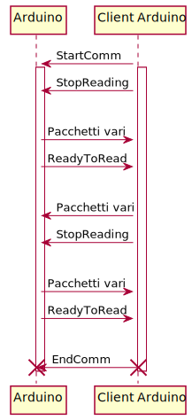

# Documento di specifica protocollo

Il funzionamento generale del protocollo utilizzato è descritto nel seguente diagramma di sequenza:

Si può notare come sia diviso in due parti distinte: 
- Comunicazione client-server
- Comunicazione punto a punto tra Arduino e client su seriale

### Client-server

Avviene mediante l'utilizzo di livello trasporto UDP.

All'interno dei datagrammi vengono spedite delle semplici stringhe che identificano il comando
che si vuole spedire.

Le stringhe seguono la codifica UTF-8.

Le stringhe inviate sono le seguenti:
- CONNECT -> "YO_BRO"
- DISCONNECT -> "SONO_MORTO"
- PRESS_BUTTON -> "B_PRESS"
- TURN_ON_LED -> "LED_ON"
- TURN_OFF_LED -> "LED_OFF"

Nel caso riceva una stringa non riconosciuta, procederà a scartarla.

Se invece riceve un comando errato (come per esempio CONNECT quando la connessione è gia stabilita),
verrà ignorato.

### Seriale

La comunicazione seriale avviene attraverso stream.

Si necessita quindi l'effettuazione di framing per riuscire a distinguere pacchetti diversi.

Questo avviene mediante 
[byte (o char) stuffing](https://en.wikipedia.org/wiki/Consistent_Overhead_Byte_Stuffing) 
con caratteri di default 
(quindi DLE -> carattere 10, STX -> carattere 2, ETX -> carattere 3).

Le informazioni spedite inoltre non sono spedite tutte come stringhe, ma in forma binaria. 
Vengono seguiti i tipo di Arduino, quindi un booleano viene spedito come un byte a 0 o 1, 
un intero come 2 byte, etc.

Gli attributi dei pacchetti hanno quindi posizione fissa in base al tipo di pacchetto.

Il tipo di pacchetto viene identificato in base a un id, spedito come primo byte, secondo il seguente schema:
- Da computer a Arduino:
    - 0 -> StartComm 
    - 1 -> EndComm
    - 3 -> StopReading
    - 4 -> Led
- Da Arduino a computer:
    - 0 -> ReadyToRead
    - 1 -> Print
    - 2 -> PressButton
    
Gli unici due pacchetti con attributi sono:
- Led, con un booleano che indica lo stato
- Print, con una stringa in UTF-8

Per non scomodare l'utilizzo di thread su Arduino, sebbene il canale sia bidirezionale, la comunicazione 
avverrà uno alla volta: se uno dei due parla, l'altro dovrà attendere fino a quando questo non ha finito.

Questo significa che il client connesso ad Arduino dovrà preoccuparsi di salvare i pacchetti da spedire 
fino a quando Arduino sarà pronto a leggere.

La comunicazione avverrà quindi nel seguente modo:
